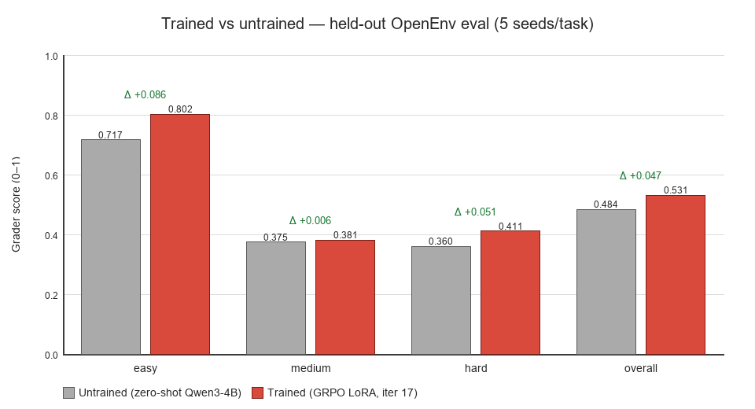

# Wildfire Resource Allocation Environment

An [OpenEnv](https://github.com/meta-pytorch/openenv)-compatible environment that
casts an LLM agent as an **incident commander** dispatching firefighting
resources — hand crews, engines, helicopters, air tankers, dozers, and
smokejumpers — across a coupled-physics terrain grid to contain wildfires
and protect structures.

- **Space:** [Chunchunmaru-101/wildfire-env](https://huggingface.co/spaces/Chunchunmaru-101/wildfire-env)
- **Live viewer:** <https://chunchunmaru-101-wildfire-env.hf.space/viewer>
- **Project writeup / story:** [`Blog.MD`](./Blog.MD)
- **Theme fit:** primary **#3.1 World Modeling / Professional Tasks**, secondary **#2 Long-Horizon Planning**.

---

## 1 · What the simulator models

Fire spread, suppression, weather, and dispatch timing are all grounded in
peer-reviewed wildfire science and U.S. NWCG operational doctrine. The
simulator is **emergence-first** — spotting, crossover, wind-driven runs,
and crown transitions are not scripted; they fall out of the coupled
dynamics.

| Coupling / mechanic | Source |
|---|---|
| Wind spread loading + base ignition (`p0=0.58`, `c1=0.045`, `c2=0.131`) | Alexandridis et al. (2008) |
| Slope spread factor | Rothermel (1972) |
| Moisture damping (Rothermel polynomial) | Rothermel (1972) |
| Spotting (downwind ember showers) | Albini (1983) |
| Fuel extinction moisture | Scott & Burgan (2005) |
| Fuel peak intensity (Byram I = H·w·r) | Byram (1959) |
| 1-h / 10-h / 100-h dead-fuel response | NWCG S-290 |
| CA spread structure | Alexandridis (2008), Freire & DaCamara (2019) |
| Diurnal cycle + 2-step Spot Forecast | NWCG PMS 425, PMS 437 |
| Aerial drop effectiveness windows | USDA FS AFUE (2018) |
| Fireline production rates | NWCG (2021) Tech Tip 1151-1805P |
| LCES safety zones | Butler & Cohen (1998), NWCG PMS 461 |
| Backfire anchor-point validation | NWCG PMS 410-1 |
| FLIR sensor swath (fog-of-war radii) | PMC (2017) |

Tactics modelled: direct attack, wet lines, retardant drops, dozer
firebreaks, water drops, and intentional backfires with anchor-point
validation under the LCES safety framework.

---

## 2 · Fleet

Six resource types with realistic dispatch timing (NWCG-sourced):

| Resource | Prep | Travel | Return | Notable |
|---|---|---|---|---|
| **Crews** | 10 min | 2.5 min/cell | 15 min | Versatile; can set backfires |
| **Engines** | 5 min | 1.5 min/cell | 10 min | Fast mobile attack; wet lines |
| **Helicopters** | 5 min | 0.6 min/cell | 8 / 20 min | **Water-scoop**: 8 min refill if water within 5 cells |
| **Air Tankers** | 8 min | 0.4 min/cell | 30 min | Long-term retardant; widest area |
| **Dozers** | 15 min | 2.0 min/cell | 20 min | Permanent firebreaks; rate by fuel type |
| **Smokejumpers** | 2 min | 0.3 min/cell | 40 min | Near-instant deploy; rare, slow return |

Each `FleetUnit` tracks `status` ∈ {`available`, `en_route`, `operating`,
`returning`}, `missions_completed`, `available_in_steps`, and `position`.
Hand-crew rates use Butler et al. (2020); aerial reload cycles use the
USDA FS AFUE study (2018).

### 2.1 Task tiers

| | easy | medium | hard |
|---|---|---|---|
| Grid | 15×15 | 20×20 | 25×25 |
| Max steps | 20 | 20 | 25 |
| Default seeded fleet | 2c 1e 1h 1d | 3c 3e 2h 1d | 5c 3e 1h 1a 2d 1s |
| Structures (default seed) | 4 × P1 | 2 × P1 + 3 × P2 | 2 × P1 + 3 × P2 |

---

## 3 · Reward design

Dense per-step shaping with grid-size normalisation
(`gn = min(1, (15/size)^1.5)`) so GRPO group variance stays meaningful
across difficulty levels.

| Signal | Amount | Trigger |
|---|---:|---|
| `structure_burning` | `-0.12 × priority × gn` | Each step a structure cell is burning |
| `structure_lost` | `-0.50 × priority × gn` | Once when a structure burns out |
| `structure_safe` | `+0.003 × priority` | Each step an intact structure is under threat |
| `cells_suppressed` | `+0.06 / cell` | Burning cell extinguished by active suppression |
| `cells_protected` | `+0.0025 / cell` | Newly protected threatened cell (cap 12/step) |
| `containment` | `+0.018 × net cells` | Net burning-cell reduction (gated on active suppression) |
| `active_fire_pressure` | `-0.005 × min(burning, 8)` | Each step fire is active |
| `fire_extinguished` | `+0.30` to `+0.70` | Once when all burning cells reach zero |
| `idle_penalty` | `-0.005 × min(avail, 4)` | Empty action while units available + fire burning |
| `LCES_VIOLATION` | `-0.03` | Hazardous ground assignment without escape |
| Invalid / low-impact | `-0.05` / `-0.02` | Rejected or wasteful assignment |

### 3.1 Anti-reward-hacking

- **Format enforcement** — XGrammar + Pydantic; malformed actions never reach the env.
- **Causal containment gate** — `containment` only pays when the agent suppressed a cell that tick.
- **No free no-ops** — `idle_penalty` scales with available units.
- **Single-use bonuses** — `structure_lost` / `fire_extinguished` fire once.
- **Duplicate-dispatch block** — same unit twice in a step → invalid penalty.

A 7-policy audit (`reward_audit.py`, 84 episodes) confirms it. Spearman
between dense reward and the deterministic grader is ≥0.92 on every task,
and no exploit-class policy (`noop`, `stage_all`, `invalid_duplicate`)
out-ranks the heuristic.

| Task | Policy Spearman | Episode Spearman | Exploit flags |
|---|---:|---:|---|
| easy | 0.964 | 0.794 | none |
| medium | 0.964 | 0.847 | none |
| hard | 0.927 | 0.897 | none |

### 3.2 Final grader (score in `(0, 1)`)

| Component | Weight |
|---|---:|
| Structure protection | 45% |
| Area preservation | 20% |
| Active containment | 15% |
| Spread limit | 10% |
| Efficiency bonus | 10% |

---

## 4 · Results

GRPO over Qwen3-4B-Instruct-2507 (4-bit QLoRA via Unsloth, XGrammar-constrained
decoding). Full pipeline in [`train_grpo.py`](./train_grpo.py); the submitted
run is the 20-iter `deadline_v2_a10g` schedule from
[`notebooks/wildfire_train_eval_hf.ipynb`](./notebooks/wildfire_train_eval_hf.ipynb).

### 4.1 Training curves


### 4.2 Trained vs. untrained (held-out OpenEnv eval)

5 seeds per task, run through the official `EnvClient` WebSocket session
against the deployed Space. The trained adapter beats the zero-shot base
model on every task tier:



| Task | Untrained | Trained | Δ |
|---|---:|---:|---:|
| easy | 0.717 | 0.802 | +0.086 |
| medium | 0.375 | 0.381 | +0.006 |
| hard | 0.360 | 0.411 | +0.051 |
| **Overall** | **0.484** | **0.531** | **+0.047** |

---

## 5 · Running locally

```bash
# OpenEnv validation
.\.venv\Scripts\openenv.exe validate .

# Server
cd wildfire_env
..\.venv\Scripts\python.exe -m uvicorn server.app:app --host 0.0.0.0 --port 8000

# Docker
docker build -t wildfire-env .
docker run -p 8000:8000 wildfire-env
```

Live viewer renders episodes in real time — animated grid, structure
priority labels, unit dots, wind compass, weather forecast — at
`/viewer`. `GET /replays` indexes captured JSON replays.

---

## 6 · References

### 6.1 Peer-reviewed wildfire science

- **Rothermel (1972)** — *A Mathematical Model for Predicting Fire Spread in Wildland Fuels.* USDA FS INT-115. <https://www.fs.usda.gov/research/treesearch/32533>
- **Albini (1983)** — *Predicting the maximum potential spotting distance from a torching tree.* USDA FS GTR-INT-309. <https://www.fs.usda.gov/research/treesearch/29611>
- **Butler & Cohen (1998)** — *Firefighter Safety Zones: A Theoretical Model Based on Radiative Heating.* IJWF 8(2). <https://www.fs.usda.gov/research/treesearch/4593>
- **Alexandridis et al. (2008)** — *A cellular automata model for forest fire spread prediction.* Applied Math & Comp 204(1). <https://doi.org/10.1016/j.amc.2008.06.046>
- **Scott & Burgan (2005)** — *Standard Fire Behavior Fuel Models.* USDA FS GTR-RMRS-153. <https://www.fs.usda.gov/research/treesearch/9521>
- **Freire & DaCamara (2019)** — *Cellular automata for wildfire propagation.* NHESS 19. <https://doi.org/10.5194/nhess-19-169-2019>
- **Byram (1959)** — *Combustion of forest fuels.* In *Forest Fire: Control and Use* (McGraw-Hill).
- **Butler et al. (2020)** — *Firefighter Travel Rates.* NWCG-published reference.

### 6.2 NWCG operational doctrine

- **PMS 410-1** — *Fireline Handbook* (anchor-point validation)
- **PMS 425** — *Guide to Fire Weather Forecasts* (Spot Forecast)
- **PMS 437** — *Fire Behavior Field Reference Guide* (diurnal cycle)
- **PMS 461** — *Incident Response Pocket Guide* (LCES)
- **S-190 / S-290** — wildland fire behavior (aspect modifiers, time-lag classes)
- **S-420 / S-505** — Class A foam, aerial supervision
- **NWCG (2021)** — *Fireline Production Rates*, San Dimas Tech Tip 1151-1805P. <https://www.frames.gov/documents/behaveplus/publications/NWCG_2021_FireLineProductionRates.pdf>

### 6.3 Agency / industry reports

- **USDA Forest Service (2018)** — *Aerial Firefighting Use and Effectiveness (AFUE) Study.* <https://www.fs.usda.gov/sites/default/files/2020-08/afue_final_report.pdf>
- **Perimeter Solutions / Phos-Chek LC-95** — long-term retardant data sheet.
- **PMC (2017)** — helicopter FLIR reconnaissance swath data (fog-of-war calibration).

### 6.4 Frameworks

- **OpenEnv** — <https://github.com/meta-pytorch/openenv>
- **Unsloth** — <https://github.com/unslothai/unsloth>
- **XGrammar** — <https://github.com/mlc-ai/xgrammar>
- **Qwen3-4B-Instruct-2507** — <https://huggingface.co/Qwen/Qwen3-4B-Instruct-2507>

---

Built for the Hugging Face × Scaler hackathon (OpenEnv environment track).
Any modelling errors are mine.
