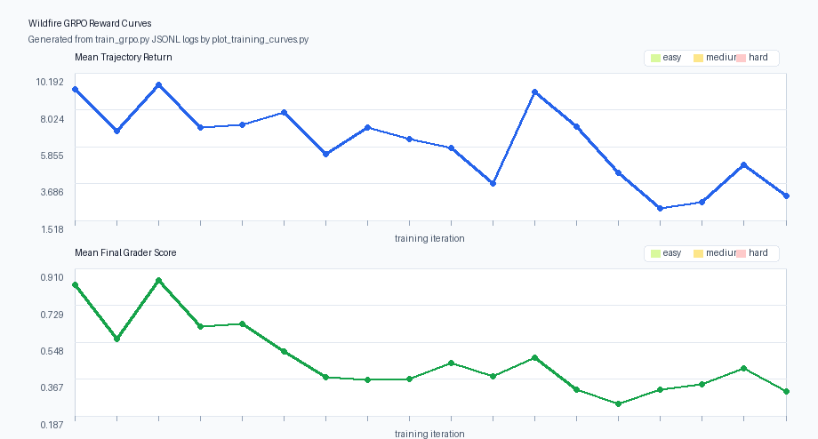
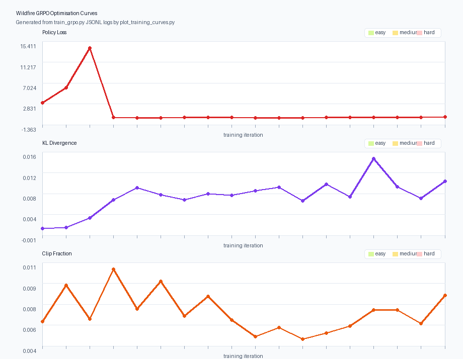

# Wildfire Resource Allocation Environment

An [OpenEnv](https://github.com/meta-pytorch/openenv)-compatible environment that
casts an LLM agent as an **incident commander** dispatching real firefighting
resources — hand crews, engines, helicopters, air tankers, dozers, and
smokejumpers — across a coupled-physics terrain grid to contain spreading
wildfires and protect structures.

Fire spread, suppression, and weather are grounded in published wildfire
science (Rothermel 1972, Alexandridis et al. 2008, Albini 1983, Butler &
Cohen 1998, Scott & Burgan 2005) and operational doctrine from the U.S.
National Wildfire Coordinating Group (NWCG). Tactics modelled include direct
attack, wet lines, retardant drops, dozer firebreaks, water drops, and
intentional backfires with anchor-point validation under the LCES safety
framework. The full reference list is at the end of this document.

**Live deployment**

- Space: [Chunchunmaru-101/wildfire-env](https://huggingface.co/spaces/Chunchunmaru-101/wildfire-env)
- App: [chunchunmaru-101-wildfire-env.hf.space](https://chunchunmaru-101-wildfire-env.hf.space)
- Live viewer: <https://chunchunmaru-101-wildfire-env.hf.space/viewer>
- Writeup: [`Blog.MD`](./Blog.MD)

---

## Hackathon Theme Fit

**Primary theme: #3.1 World Modeling / Professional Tasks**

This environment is best framed as a professional incident-command simulator:

- the agent operates inside a dynamic, partially observable world
- actions have delayed physical consequences through logistics, travel, and fire spread
- the agent must maintain consistent internal state across multiple turns
- success depends on tool-like orchestration of heterogeneous resources, not one-shot text answers

**Secondary theme: #2 Long-Horizon Planning & Instruction Following**

Long-horizon planning fits because the policy has to:

- commit scarce assets early without knowing the full fire picture (delayed ignitions, fog of war)
- recover from weak opening moves over 20-25 steps
- track unit availability, return-to-service timing, and structure priorities through the episode

This submission is a single-agent world-modeling environment with long-horizon planning — not a multi-agent or self-play arena.

---

## Submission Links

- **Live Space:** [Chunchunmaru-101/wildfire-env](https://huggingface.co/spaces/Chunchunmaru-101/wildfire-env)
- **Live app:** [chunchunmaru-101-wildfire-env.hf.space](https://chunchunmaru-101-wildfire-env.hf.space)
- **Training pipeline:** [`train_grpo.py`](./train_grpo.py) — primary GPU path is the [Space-hosted training notebook](https://huggingface.co/spaces/Chunchunmaru-101/wildfire-env/blob/main/notebooks/wildfire_training_eval_hf.ipynb) (kept in sync with [`notebooks/wildfire_training_eval_hf.ipynb`](./notebooks/wildfire_training_eval_hf.ipynb))
- **Reward-hacking audit:** [`reward_audit.py`](./reward_audit.py) + [`reward_audit.json`](./reward_audit.json) — 84 fixed-seed episodes (7 policies × 4 seeds per task × 3 tasks; seed list in `DEFAULT_AUDIT_SEED_BANK`, not the GRPO `seeds_per_task` pool), no exploit-class policy flagged
- **OpenEnv showcase eval:** [`eval_policy_http.py`](./eval_policy_http.py) drives both untrained and trained policies via the official OpenEnv `EnvClient` WebSocket session (`reset`/`step` on `/ws`) plus the wildfire `POST /grader` HTTP endpoint
- **Submission artifact helpers:** [`plot_training_curves.py`](./plot_training_curves.py) and [`submission_check.py`](./submission_check.py)
- **Writeup:** [`Blog.MD`](./Blog.MD) — the separate judge-facing blog file requested for the Hugging Face Space
- **Submission artifacts after a real GPU run:** [`submission_artifacts/training_reward_curve.png`](./submission_artifacts/training_reward_curve.png), [`submission_artifacts/training_loss_curve.png`](./submission_artifacts/training_loss_curve.png), [`submission_artifacts/eval_untrained.json`](./submission_artifacts/eval_untrained.json), [`submission_artifacts/eval_trained.json`](./submission_artifacts/eval_trained.json), [`submission_artifacts/training_summary.md`](./submission_artifacts/training_summary.md)

---

## Why this environment

This is a real-world resource allocation task, not a toy game. The agent must
make sequential decisions under uncertainty and delay:

- choose which unit to send
- choose where to send it
- choose the mission geometry and commitment
- account for limited fleet size, travel time, and return-to-service timing
- balance structure protection vs containment vs efficiency

A blank action while fire is spreading is **never** a good move — the dense
reward and the deterministic grader both penalise idleness when units are
available, and the LCES safety doctrine and duplicate-dispatch checks make
the obvious shortcut policies fail.

> **Suggested architecture diagram (please generate):** a single-page
> figure showing `LLM agent` ⇄ `OpenEnv EnvClient (/ws)` ⇄ `FastAPI server`
> ⇄ `WildfireEnvironment` ⇄ `fire_simulation.py` (CA spread, weather,
> suppression). I will embed it under this section. Filename suggestion:
> `submission_artifacts/architecture.png`.

---

## What's in this repo

- OpenEnv-compliant environment with a valid [`openenv.yaml`](./openenv.yaml) manifest and `openenv-core[core]>=0.2.3` pin
- FastAPI server exposing `/reset`, `/step`, `/state`, `/grader`, `/baseline`, `/tasks`, `/ws`, `/demo`, `/demo_replay`, `/viewer`, `/replays`
- Deterministic heuristic baseline and deterministic grader for reproducible evaluation
- Hand-rolled multi-turn GRPO training pipeline ([`train_grpo.py`](./train_grpo.py)) — Qwen3-4B-Instruct-2507 + 4-bit QLoRA (Unsloth) + XGrammar-constrained decoding
- Single OpenEnv showcase evaluator ([`eval_policy_http.py`](./eval_policy_http.py)) for both untrained and trained adapter runs against the deployed Space, using the official `EnvClient` WebSocket session for stateful multi-turn rollouts
- Run metadata + checkpoint index files so Hugging Face runs are restartable and auditable
- GPU preflight ([`smoke_test.py`](./smoke_test.py)) — 1-iteration tiny GRPO run to validate the training stack before a full curriculum
- Reward-hacking audit harness ([`reward_audit.py`](./reward_audit.py)) running a 7-policy bank against the dense reward and grader, with rank-correlation reporting and exploit-class flagging
- Training plot/export helper ([`plot_training_curves.py`](./plot_training_curves.py)) — turns `log.jsonl` into judge-friendly SVG/PNG reward/loss curves with no extra plotting dependency
- Submission readiness checker ([`submission_check.py`](./submission_check.py)) for the final hackathon packaging pass
- Hugging Face notebooks: [`notebooks/wildfire_training_eval_hf.ipynb`](./notebooks/wildfire_training_eval_hf.ipynb) (four code cells: GRPO **Cell 4** = 20-iter `deadline_v2_a10g`; [Space](https://huggingface.co/spaces/Chunchunmaru-101/wildfire-env/blob/main/notebooks/wildfire_training_eval_hf.ipynb)) and [`notebooks/wildfire_http_eval_hf.ipynb`](./notebooks/wildfire_http_eval_hf.ipynb) (OpenEnv HTTP eval + plots/artifacts)

---

## Action Space

`WildfireAction` is a batch of resource assignments issued in one decision interval.

```python
class WildfireAction(Action):
    plan: str = ""                          # optional one-sentence rationale, ignored by env
    assignments: list[ResourceAssignment]   # can be empty (no-op)

class ResourceAssignment(BaseModel):
    unit_id: str                            # e.g. "crew_1", "helicopter_2"
    mission_type: MissionType
    target: TargetSpec
    commitment_steps: int = 1               # 1-12; how many steps to stay on mission
    drop_configuration: "salvo" | "trail" | None = None  # aerial drops only
```

`plan` is preserved in the JSON schema so grammar-constrained models can emit
a short tactical rationale without breaking parse rate. The simulator ignores
it and only executes `assignments`.

### Mission Types

| Mission | Valid Resources | Effect |
|---------|----------------|--------|
| `direct_attack` | crews, engines, smokejumpers | Suppress burning cells — reduce heat, intensity, add moisture |
| `line_construction` | crews, dozers, smokejumpers | Build permanent `FIREBREAK` cells (mineral soil) |
| `wet_line` | engines | Water/foam line — high moisture decaying over several steps (Class A foam effect, NWCG S-420) |
| `water_drop` | helicopters | Aerial water bucket — moderate area, fast turnaround near water bodies |
| `retardant_drop` | airtankers | Long-term retardant — permanent ignition-threshold increase over wide area |
| `point_protection` | crews, engines, helicopters, dozers, smokejumpers | Guard a location continuously |
| `backfire` | crews, engines | Deliberately ignite cells to consume fuel ahead of the main fire — anchor-point validated (NWCG PMS 410-1) |
| `staging` | all | Reposition standby location — no combat effect |

### Target Kinds

| Kind | Schema | Use Case |
|------|--------|----------|
| `point` | `{"point": {"row": R, "col": C}}` | Single cell |
| `line` | `{"waypoints": [{"row":R1,"col":C1}, ...]}` | Multi-cell line, Bresenham drawn |
| `area` | `{"center": {"row":R,"col":C}, "radius": N}` | Circular area |
| `polygon` | `{"vertices": [...]}` | Arbitrary polygon (≤ 8 vertices) |
| `structure` | `{"structure_id": "structure_1"}` | Named structure |

---

## Observation Space

`WildfireObservation` provides a complete incident picture each step:

| Field | Type | Description |
|-------|------|-------------|
| `task_id` | str | Current task: `easy`, `medium`, or `hard` |
| `goal` | str | Natural-language task objective |
| `action_guide` | str | **Per-step LLM guide** — available units + valid missions + tactical summary |
| `step` / `max_steps` | int | Current step and episode limit |
| `elapsed_minutes` | float | Incident time (20 min per step) |
| `wind_speed` / `wind_direction` | float | Current atmosphere |
| `temperature` / `humidity` | float | Current atmosphere |
| `forecast` | list | 2-step Spot Forecast (NWCG PMS 425) — diurnal temp/humidity + wind trend |
| `burning_cells` / `burned_cells` | int | Fire extent (totals always visible) |
| `fire_details` | list | Per-cell `{row, col, intensity, timer}` for **visible** burning cells (fog-of-war filtered) |
| `heat_warnings` | list | Cells approaching ignition threshold (visible only) |
| `structures` | list | Per-structure `{structure_id, row, col, priority, status}` |
| `structures_remaining` / `structures_lost` | int | Structure tally |
| `fleet_units` | list | Per-unit `{unit_id, resource_type, status, position, missions_completed, available_in_steps, ...}` |
| `fleet_status` | list | Per-resource-type status counts |
| `active_missions` | list | Non-available units with ETAs |
| `resources_remaining` | dict | Available unit count per type |
| `elevation` | list[list[int]] | `grid_size×grid_size` elevation map (15×15 easy, 20×20 medium, 25×25 hard) |
| `fuel_types` | list[list[int]] | `grid_size×grid_size` fuel map (0=none, 1=grass, 2=brush, 3=forest) |
| `visible_cell_count` / `fog_of_war_active` | int / bool | Visibility metadata |
| `last_action_summary` | str | What happened last step |
| `last_action_error` | str \| None | Validation error, if any |
| `reward` | float | Dense per-step reward |

### `action_guide` (key feature)

Every observation includes a natural-language `action_guide` that lists
which units are available right now, what missions they can perform, which
units are committed and their ETAs, and a short tactical summary. LLM agents
use this directly without memorising the resource-mission compatibility
matrix.

```text
AVAILABLE (can dispatch now):
  crew_1 [crews]: backfire | direct_attack | line_construction | point_protection | staging
  engine_1 [engines]: backfire | direct_attack | point_protection | staging | wet_line
  helicopter_1 [helicopters]: point_protection | staging | water_drop
COMMITTED:
  dozer_1 operating → line_construction, done in 1 step(s)
  crew_2 returning, available in 2 step(s)

FIRE: 4 burning | 7 burned. Wind: 15 km/h from NE (45°)
STRUCTURES: structure_1(p1,safe) | structure_2(p2,safe)
```

### Partial observability (fog of war)

Only cells within sensor range of a deployed resource are fully visible.
Per-resource sensor radii use Euclidean grid discs calibrated from PMC
(2017) FLIR reconnaissance data:

| resource | radius (deployed) | radius (standby) |
|---|---:|---:|
| helicopter | 6 | 2 |
| airtanker | 5 | 2 |
| crew / smokejumper | 4 | 2 |
| engine / dozer | 3 | 2 |

`burning_cells` (the total count) remains unmasked — the agent knows the
fire exists but must deploy air assets to localise it. This is the core
incident-commander tension the environment models.

### LCES safety doctrine

Ground-resource assignments (`direct_attack`, `line_construction`,
`backfire`, `wet_line`) are checked against NWCG **LCES** (Lookouts /
Communications / Escape Routes / Safety Zones). If a burning cell is
immediately adjacent to the target and no escape cell (firebreak, water,
burned, suppressed) is reachable within 2 cells, a `-0.03` penalty is
applied per **Butler & Cohen (1998)** safety-zone criterion. Backfire
ignitions also require a valid anchor point (firebreak / water / burned
edge) per NWCG PMS 410-1.

---

## Fleet System

Six resource types with realistic dispatch timing (NWCG-sourced):

| Resource | Prep | Travel | Return | Notable |
|----------|------|--------|--------|---------|
| **Crews** | 10 min | 2.5 min/cell | 15 min | Versatile; can set backfires |
| **Engines** | 5 min | 1.5 min/cell | 10 min | Fast mobile attack; wet lines |
| **Helicopters** | 5 min | 0.6 min/cell | 8 min (scoop) / 20 min (base) | **Water-scoop mechanic**: refills in 8 min if a water body is within 5 cells of the drop target |
| **Air Tankers** | 8 min | 0.4 min/cell | 30 min | Long-term retardant; widest area coverage |
| **Dozers** | 15 min | 2.0 min/cell | 20 min | Permanent firebreaks; rate varies by fuel type (Anderson fuel models) |
| **Smokejumpers** | 2 min | 0.3 min/cell | 40 min | Near-instant deployment anywhere; rare and slow return |

Each `FleetUnit` tracks: `status` ∈ {`available`, `en_route`, `operating`,
`returning`}, `missions_completed` (cumulative), `available_in_steps`, and
current `position`. Hand-crew travel rates use NWCG Butler et al. (2020)
firefighter travel rates. Fireline production rates use the NWCG (2021) San
Dimas Tech Tip; aerial drop reload cycles and effectiveness use the USDA FS
**AFUE** study (2018).

---

## Tasks

Three graded difficulty levels with cellular-automaton fire spread
(Alexandridis 2008, Rothermel 1972). Per-task spec below; `DIFFICULTY_SPECS`
(`wildfire_env/server/terrain.py`) is the source of truth for **ranges**. The
**weather, water, structure mix, and fleet** numbers in the table are the
values **resolved at `DEFAULT_SEEDS`** (`easy=7`, `medium=6`, `hard=9`); other
seeds draw different concrete scenarios within the same spec ranges.

| | easy | medium | hard |
|---|---|---|---|
| Grid | 15×15 | 20×20 | 25×25 |
| Max steps | 20 | 20 | 25 |
| Default seed | 7 | 6 | 9 |
| Step-0 ignition groups (range) | 1–2 | 2 | 2 |
| Delayed ignition groups (range) | 0–1 | 1–2 | 2–3 |
| Temperature (at default seed) | ~29.4 °C | ~32.5 °C | ~38.1 °C |
| Humidity (at default seed) | ~42.5% | ~30.2% | ~38.5% |
| Wind (at default seed) | ~10.5 km/h | ~19.2 km/h | ~21.5 km/h |
| Water bodies (at default seed) | 2 | 1 | 1 |
| Structures (at default seed) | 4 × P1 | 2 × P1 + 3 × P2 | 2 × P1 + 3 × P2 |
| Default seeded resources | 2c 1e 1h 1d | 3c 3e 2h 1d | 5c 3e 1h 1a 2d 1s |
| Warmup before first observation | 0 steps | 0 steps | 2 steps (40 min) |

### Grader formula (strictly within `(0, 1)`)

| Component | Weight | What it rewards |
|-----------|------:|---|
| Structure protection | **45%** | saved priority / total priority, weighted by priority value |
| Area preservation | **20%** | fraction of burnable terrain not burned or burning at episode end |
| Active containment | **15%** | ending with little or no active fire |
| Spread limit | **10%** | keeping damaged area below a difficulty-scaled incident budget |
| Efficiency bonus | **10%** | only when fire fully contained — faster is better |

---

## Fire Simulation Physics

The simulator is **emergence-first**: primary state variables and their
direct couplings are modelled explicitly, and named wildfire phenomena
(spotting, crossover, wind-driven runs, crown fire transition) are not
scripted — they emerge naturally from the coupled dynamics.

| Coupling | Source |
|----------|--------|
| Wind spread loading + base ignition prob (`p0=0.58`, `c1=0.045`, `c2=0.131`) | Alexandridis et al. (2008) |
| Slope spread factor | Rothermel (1972), via Alexandridis |
| Moisture damping (Rothermel polynomial) | Rothermel (1972) |
| Spotting (downwind ember showers) | Albini (1983) compact form |
| Fuel extinction moisture (Scott & Burgan 2005 categories) | Scott & Burgan (2005) |
| Fuel peak intensity (Byram I = H·w·r proportional) | Byram (1959) |
| Fine dead fuel response (1-h, 10-h, 100-h time-lag classes) | NWCG S-290 |
| CA spread structure | Alexandridis (2008), Freire & DaCamara (2019) |
| Weather diurnal cycle + Spot Forecast | NWCG PMS 425, PMS 437 |
| Aerial drop effectiveness windows | USDA FS AFUE study (2018) |
| Fireline production rates | NWCG 2021 San Dimas Tech Tip 1151-1805P |
| Aspect modifiers | NWCG S-190 |
| LCES safety zones | Butler & Cohen (1998), NWCG PMS 461 (IRPG) |
| Backfire anchor-point validation | NWCG PMS 410-1 (Fireline Handbook) |
| FLIR sensor swath calibration | PMC (2017) helicopter recon |

Full citations in [References & Sources](#references--sources).

---

## Reward Function

Reward signals are grid-size normalised on structural penalties (factor
`gn = min(1, (15/size)^1.5)` — `1.00` on 15×15, `~0.46` on 25×25) so GRPO
group variance stays meaningful across difficulty levels.

| Signal | Amount | Trigger |
|---|---:|---|
| `structure_burning` | `-0.12 × priority × gn` | Each step a structure cell is burning |
| `structure_lost` | `-0.50 × priority × gn` | **Once** when a structure transitions to burned |
| `structure_safe` | `+0.003 × priority` | Each step an intact structure remains under nearby threat |
| `cells_suppressed` | `+0.06` per cell | Each burning cell extinguished by active suppression that step |
| `cells_protected` | `+0.0025` per cell | Each newly protected threatened unburned cell, capped at 12 / step |
| `containment` | `+0.018 × net cells` | Net burning-cell reduction, **gated on active suppression** |
| `active_fire_pressure` | `-0.005 × min(burning, 8)` | Each step while fire remains active |
| `fire_extinguished` | `+0.30` to `+0.70` | **Once** when all burning cells reach zero, scaled by containment speed |
| Mission dispatch cost | `-0.0008` to `-0.0112` | Per dispatch, by mission type |
| Resource dispatch surcharge | `-0.0004` to `-0.0030` | Additional per dispatch, by resource type |
| `idle_penalty` | `-0.005 × min(avail, 4)` | Empty `assignments[]` while fire is burning and units are available |
| `LCES_VIOLATION_PENALTY` | `-0.03` | Hazardous ground assignment without a reachable safety zone |
| Invalid action | `-0.05` | Rejected assignment |
| Low-impact action | `-0.02` | Wasteful assignment with negligible effect |

Weather conditions (temperature, humidity, wind) are observable but do not
directly generate reward signals. The agent should learn that adverse weather
increases fire spread risk and adjust tactics accordingly.

### Anti-reward-hacking design

Per the hackathon guide on reward-hacking (§8), multiple independent checks
protect the training signal:

- **Format enforcement** — XGrammar-constrained decoding + Pydantic validation; malformed actions can't reach the env.
- **Causal containment gate** — `containment` only pays when the agent actively suppressed at least one cell that tick; natural fuel burnout earns nothing.
- **No free no-ops** — `idle_penalty` scales with available units when the agent skips action while fire burns.
- **Single-use penalties** — `structure_lost` fires once per structure; `fire_extinguished` fires once per episode.
- **Duplicate-dispatch block** — assigning the same unit twice in a step triggers the invalid-action penalty.
- **Min-step guard** — episodes cannot terminate before 3-6 steps (`min_steps_before_early_end`) to prevent early-exit reward farming.

### Reward audit (`reward_audit.py` / `reward_audit.json`)

A fixed 7-policy bank — `noop`, `heuristic`, `heuristic_ground_only`,
`heuristic_aerial_only`, `stage_all`, `invalid_duplicate`, `random_valid` —
runs 84 episodes using `DEFAULT_AUDIT_SEED_BANK` in `reward_audit.py` (four
seeds per task, independent of `train_grpo.py`’s `seeds_per_task`). We check rank correlation
between the dense shaped reward and the deterministic grader, and flag any
exploit-class policy that out-ranks `heuristic` on the grader.

| Task | Policy Spearman | Policy Kendall | Episode Spearman | Exploit flags |
|---|---:|---:|---:|---|
| easy | 0.964 | 0.926 | 0.794 | none |
| medium | 0.964 | 0.926 | 0.847 | none |
| hard | 0.927 | 0.823 | 0.897 | none |

Exploit policies (`noop`, `stage_all`, `invalid_duplicate`) consistently
rank below the sane policies on every task and never out-rank the heuristic
on the final grader, confirming the gating and duplicate-dispatch blocks
work in practice. Episode-level correlation is noisier because seed
difficulty changes absolute return scale; the more relevant signal here is
policy-level ranking. Full per-policy breakdown is in
[`reward_audit.json`](./reward_audit.json).

Rerun with:

```bash
.\.venv\Scripts\python.exe reward_audit.py --json-out reward_audit.json
```

---

## API Endpoints

| Method | Path | Description |
|--------|------|-------------|
| `POST` | `/reset` | Reset to the next task; returns initial observation |
| `POST` | `/step` | Submit action, advance one tick; returns observation |
| `GET` | `/state` | Return current environment state |
| `GET` | `/schema` | Return action and observation JSON schemas |
| `WS` | `/ws` | **Stateful WebSocket session** for multi-step episodes (used by `EnvClient`; clients may reconnect after transient proxy/Space errors) |
| `GET` | `/tasks` | List all tasks, action schema, resource-mission compatibility |
| `POST` | `/grader` | Grade a completed episode (pass final observation data) |
| `GET` | `/baseline` | Run deterministic heuristic agent; return reproducible scores |
| `GET` | `/viewer` | Live HTML viewer (live heuristic stream + replay) |
| `WS` | `/demo` | WebSocket-streamed live heuristic episode for the viewer |
| `WS` | `/demo_replay` | WebSocket-streamed captured-episode JSON for the viewer |
| `GET` | `/replays` | Index of captured replays visible to the server |

> **Why WebSocket and not raw `POST /reset` + `POST /step`?** OpenEnv's HTTP
> handlers (`HTTPEnvServer.register_routes` in `openenv-core`) construct a
> fresh `Environment` per request and tear it down — they're stateless by
> design and intended for one-shot sanity checks. Multi-turn rollouts
> require the persistent session that `EnvClient` provides. We discovered
> this the hard way mid-hackathon when our first eval pass returned
> `obs.step == 1` after every `step` call regardless of how many turns we
> ran; the official client fixed it immediately. The eval pipeline now uses
> `WildfireEnv(...).sync()` on `/ws` for stateful rollouts and only uses
> raw HTTP for the one-shot `POST /grader` call at episode end.

### `/grader` example

```bash
curl -X POST http://localhost:8000/grader \
  -H "Content-Type: application/json" \
  -d '{
    "task_id": "easy",
    "step": 12,
    "max_steps": 20,
    "structures": [{"priority": 1, "status": "safe"}, {"priority": 1, "status": "safe"}],
    "burned_cells": 9,
    "burning_cells": 0
  }'
# → {"score": 0.891, "components": {...}, ...}
```

---

## Baselines

Deterministic heuristic baseline measured on five **held-out** seeds per task
(no overlap with the 16-seed training pool in `train_grpo.py`). All seeds
were selected from an expanded per-task sweep (training pool draws include
seed **80** on easy/hard) and filtered to heuristic grader in
`[0.2, 0.85]` (signal-rich; excludes dead-zone and trivially-won scenarios).

| task | mean | min | max | held-out eval seeds |
|---|---:|---:|---:|---|
| easy | 0.5546 | 0.4237 | 0.6670 | 11, 18, 25, 56, 76 |
| medium | 0.4571 | 0.2641 | 0.5853 | 1, 7, 28, 61, 69 |
| hard | 0.4786 | 0.3030 | 0.6074 | 9, 28, 32, 61, 75 |

These are produced by the structure-aware heuristic in
`wildfire_env/server/app.py` (`_heuristic_action`). The heuristic ranks
fires by structure proximity and matches resources to missions greedily; it
plateaus on multi-front incidents (medium, hard) where the trained policy
must pre-position units against the forecast and split coverage across
priority structures.

The showcase evaluation in [`eval_policy_http.py`](./eval_policy_http.py)
runs the same five seeds per task through the official OpenEnv `EnvClient`
WebSocket session: a **single** `WildfireEnv(...).sync()` context keeps
`/ws` open for the whole run (`reset` then `step` per episode; optional
reconnect with backoff on transient `ConnectionClosed` / proxy errors, up to
four attempts) plus the wildfire-specific `POST /grader` HTTP call at
episode end. Each episode runs to the env's own `max_steps` (20 for
easy/medium, 25 for hard) so delayed ignitions actually have time to fire —
no arbitrary truncation. The trained-vs-baseline delta in
`submission_artifacts/eval_*.json` is therefore a clean held-out OpenEnv
signal.

---

## Training

A multi-turn GRPO pipeline lives in [`train_grpo.py`](./train_grpo.py). Stack:

- **Base model:** Qwen3-4B-Instruct-2507 (4-bit QLoRA via Unsloth)
- **Constrained decoding:** XGrammar against the action JSON schema
- **Algorithm:** hand-rolled multi-turn GRPO loop — TRL's `GRPOTrainer` is single-turn only; multi-turn trajectory advantages require a custom loop
- **Optimizer:** AdamW8bit (bitsandbytes), `lr=3e-5` cosine to `5e-6`, `warmup_iters` linear
- **LoRA:** rank 16, alpha 32, targets `q/k/v/o_proj`, dropout 0.05 (default config)

### Why a 16-seed training pool, not thousands

Standard RL setups (PPO on Atari, MuJoCo) train on millions of frames
across thousands of randomly sampled environment seeds. The reasoning is
that each seed contributes one tiny gradient nudge, and diversity beats
repetition for generalization. That math depends on having enough total
samples — typically 10⁶-10⁸ frames — for the law of large numbers to kick
in.

The *default* `Config` in `train_grpo.py` does not. The compute budget
**for that default** is 60 GRPO iterations × 4 trajectories =
**240 total episodes** (`python train_grpo.py` with no overrides). The
[Hugging Face training notebook](./notebooks/wildfire_training_eval_hf.ipynb)
uses a **20-iteration** `deadline_v2_a10g` schedule in Cell 4 instead — see
that file and `grpo_wildfire/config.json` after a run.

Stretching 240 episodes across 1000 unique seeds means each scenario is
seen ~0.24 times on average — far below what GRPO needs for meaningful
within-group advantage estimation (which compares trajectories on the
*same task* and computes `(r - mean_r) / std_r`). With unique-seed-per-iter
sampling the std collapses on lucky/unlucky scenarios, the gradient becomes
noisy, and `inner_epochs=4` re-uses data the model has already adapted to.

The 16-seed pool is the deliberate middle ground:

- **Per-scenario sample count.** With `seeds_per_iter=2` × `group_size=4` and
  `vary_env_seed_in_group=True`, each iteration visits ~4 unique scenarios.
  Over 60 iterations the policy sees roughly 120-200 distinct env states
  with meaningful repetition (~5-10 per scenario), enough for stable advantages.
- **Difficulty filtering.** Seeds were screened against a broad sweep of the
  heuristic (per-task; the training pool includes seed 80 on easy/hard). Seeds outside the 0.2-0.85 grader range were dropped: dead-zone
  seeds (heuristic ≈ 0) collapse within-group variance, and trivially-won
  seeds (heuristic ≈ 1) leave no headroom for the policy to learn from.
- **Difficulty spread.** The 16 seeds per task are picked evenly across the
  surviving 0.2-0.85 range, so the curriculum sees a representative slice
  at each difficulty tier rather than clustering on one variant.
- **Held-out generalization check.** The eval seeds (5 per task) are drawn
  from the same style of screening but are disjoint from the 16 training
  seeds per task. If the trained policy
  beats the heuristic on training seeds but not eval seeds, that's
  overfitting to the pool — the eval JSONs are designed to surface that
  failure mode.

The honest tradeoff: a wider seed pool would generalize better *if* the
compute existed to support it. Under the default 60-iter `Config`,
concentrating those 240 episodes on 16 representative scenarios is the
intended way to get a more reliable gradient than spreading the same budget
across thousands of one-off seeds.

### Training notebook vs `train_grpo.py`

The [Hugging Face Space copy](https://huggingface.co/spaces/Chunchunmaru-101/wildfire-env/blob/main/notebooks/wildfire_training_eval_hf.ipynb)
and [`notebooks/wildfire_training_eval_hf.ipynb`](./notebooks/wildfire_training_eval_hf.ipynb)
should stay in sync. The notebook has **four code cells**; **Cell 4** runs a
full **20-iteration** `deadline_v2_a10g` `Config` (compressed curriculum, larger
`micro_batch_size` on A10G — see the notebook source). For the **60-iteration**
default [`Config`](./train_grpo.py), run `python train_grpo.py` from the repo
root. After any run, `grpo_wildfire/config.json` and `grpo_wildfire/log.jsonl`
are the source of truth.

`train_grpo.py` is **resume-safe**: every iter writes
`grpo_wildfire/latest/`, `optimizer_state.pt`, and `resume_state.json`. On
restart the script re-loads the LoRA adapter + optimizer state and picks up
at `next_iter`. LoRA shape (`lora_rank`, `lora_alpha`,
`lora_target_modules`) is the only thing that must not change between
resumes; rollout/training knobs (`group_size`, `micro_batch_size`,
`seeds_per_iter`, `max_new_tokens`) can be bumped freely between iters.

> **Suggested training-loop diagram (please generate):** GRPO loop showing
> `rollout (group_size × seeds_per_iter trajectories)` → `compute group
> advantages` → `inner training (micro_batch × inner_epochs)` →
> `save latest/ + resume_state.json`. Filename suggestion:
> `submission_artifacts/grpo_loop.png`.

---

## Setup

OpenEnv validation:

```bash
.\.venv\Scripts\openenv.exe validate .
```

Install training extras with:

```bash
.\.venv\Scripts\python.exe -m pip install -e .[train]
```

The full training path requires a CUDA GPU. On CPU-only hardware,
`smoke_test.py` fails fast with a clear error; use the Hugging Face training
notebook for GPU runs:

```bash
.\.venv\Scripts\python.exe smoke_test.py   # 1-iter preflight, GPU only
```

Run server locally:

```bash
cd wildfire_env
..\.venv\Scripts\python.exe -m uvicorn server.app:app --host 0.0.0.0 --port 8000
```

Docker from repo root:

```bash
docker build -t wildfire-env .
docker run -p 8000:8000 wildfire-env
```

### Live viewer + replays

A websocket-streaming demo at `/viewer` renders episodes in real time —
animated grid, structure priority labels, unit movement dots, wind compass,
2-step weather forecast, and a per-step action summary. The grid resizes
automatically for the 20×20 medium and 25×25 hard tasks.

```text
http://localhost:8000/viewer                                # live heuristic stream
http://localhost:8000/viewer?replay=replays/foo.json        # stream a pre-recorded JSON replay (see /demo_replay)
```

`GET /replays` returns an index of every JSON visible to the server under
`replays/`, `submission_artifacts/`, or `artifacts/`.

---

## Submission Workflow

Once you have GPU access, this is the clean path to a final submission package:

```bash
.\.venv\Scripts\python.exe reward_audit.py --json-out reward_audit.json
.\.venv\Scripts\python.exe train_grpo.py
.\.venv\Scripts\python.exe eval_policy_http.py --untrained --base-url https://chunchunmaru-101-wildfire-env.hf.space --seeds-per-task 5 --output submission_artifacts/eval_untrained.json
.\.venv\Scripts\python.exe eval_policy_http.py --base-url https://chunchunmaru-101-wildfire-env.hf.space --seeds-per-task 5 --output submission_artifacts/eval_trained.json --plot-training
.\.venv\Scripts\python.exe submission_check.py --strict
```

`--plot-training` on the trained run writes the same `training_*.png/.svg` and
`training_summary.md` as [`plot_training_curves.py`](./plot_training_curves.py)
when `grpo_wildfire/log.jsonl` exists (output goes to `submission_artifacts/`). You
can run `plot_training_curves.py` separately instead if you prefer.

> **Note:** `python train_grpo.py` runs the **default 60-iteration** configuration
> the environment was tuned for. The actual hackathon submission was produced
> by the **20-iteration `deadline_v2_a10g`** run from Cell 4 of
> [`notebooks/wildfire_training_eval_hf.ipynb`](./notebooks/wildfire_training_eval_hf.ipynb)
> (see the [public Space](https://huggingface.co/spaces/Chunchunmaru-101/wildfire-env/blob/main/notebooks/wildfire_training_eval_hf.ipynb)).
> Reproduce the submitted run with that notebook, not the bare `python train_grpo.py` line
> above.

`train_grpo.py` writes `config.json`, `task_catalog.json`, `run_status.json`,
`checkpoint_index.json`, `latest_metrics.json`, `latest/`,
`best_adapter_<task>/`, and `final_adapter/` into the run directory, so a
Hugging Face job can be resumed and audited without guessing paths.

The outputs land in [`submission_artifacts/`](./submission_artifacts/),
which is where the final reward/loss plots and OpenEnv eval JSONs should be
committed before the final hackathon push.

---

## Results

The repository is wired to generate these files after a real GPU run:

- `submission_artifacts/training_reward_curve.png`
- `submission_artifacts/training_loss_curve.png`
- `submission_artifacts/training_summary.md`
- `submission_artifacts/eval_untrained.json`
- `submission_artifacts/eval_trained.json`

After training, run [`eval_policy_http.py`](./eval_policy_http.py) for
baseline and trained OpenEnv scores; add `--plot-training` on the trained
call (or run [`plot_training_curves.py`](./plot_training_curves.py) once) to
materialize the plots and summary. The evaluator usually completes the full eval in
one `WildfireEnv` WebSocket context; on transient connection drops it
retries with backoff. Per-episode rollouts use `reset` once then `step`
until the env reports `done` or hits its own `max_steps`.

### Training curves

From `grpo_wildfire/log.jsonl` (17 completed outer iterations of the `deadline_v2_a10g` run; 18 lines in the log file are normal). Plots and [`training_summary.md`](./submission_artifacts/training_summary.md) are generated by [`plot_training_curves.py`](./plot_training_curves.py) (or `eval_policy_http.py --plot-training`) and are committed under `submission_artifacts/`.





Summary snapshot (see [`training_summary.md`](./submission_artifacts/training_summary.md) for the table): 18 log lines, final iter 17 on **hard**, final mean return ≈2.95, final mean in-rollout grader ≈0.31, final parse success 87.5%.

### Trained vs untrained (OpenEnv showcase eval)

Same held-out seeds per task, [`eval_policy_http.py`](./eval_policy_http.py) on the public Space. Numbers from committed [`eval_untrained.json`](./submission_artifacts/eval_untrained.json) and [`eval_trained.json`](./submission_artifacts/eval_trained.json) (iter-17 LoRA):

| Task | Untrained mean | Trained mean | Δ |
|---:|---:|---:|---:|
| easy | 0.717 | 0.802 | +0.086 |
| medium | 0.375 | 0.381 | +0.006 |
| hard | 0.360 | 0.411 | +0.051 |
| **Overall** | **0.484** | **0.531** | **+0.047** |

---

## Repository layout

- `Dockerfile` — Space container
- `openenv.yaml` — OpenEnv manifest
- `train_grpo.py` — multi-turn GRPO training pipeline
- `eval_policy_http.py` — OpenEnv showcase evaluation for baseline and trained policies (uses `EnvClient` WebSocket session)
- `eval_policy.py` — thin wrapper that runs `eval_policy_http` (legacy script name)
- `smoke_test.py` — optional 1-iter GRPO preflight (GPU)
- `reward_audit.py` — reward-hacking audit harness
- `plot_training_curves.py` — SVG/PNG reward/loss plot generator for `log.jsonl`
- `submission_check.py` — final packaging checker for hackathon submission
- `submission_artifacts/` — generated training plots, eval JSONs, final evidence
- `replays/` — optional frame JSONs for the `/viewer?replay=…` + `/demo_replay` path
- `notebooks/wildfire_training_eval_hf.ipynb` — Hugging Face GPU training (same as [Space](https://huggingface.co/spaces/Chunchunmaru-101/wildfire-env/blob/main/notebooks/wildfire_training_eval_hf.ipynb))
- `notebooks/wildfire_http_eval_hf.ipynb` — OpenEnv baseline/trained evaluation and final artifacts
- `wildfire_env/` — environment package (server, models, fire simulation, terrain)
- `Blog.MD` — separate judge-facing writeup for the Hugging Face Space

---

## References & Sources

The simulator's physics, doctrine, and timing constants are grounded in
peer-reviewed wildfire science and U.S. National Wildfire Coordinating
Group (NWCG) operational publications. The code references these inline.

### Peer-reviewed wildfire science

- **Rothermel, R. C. (1972).** *A Mathematical Model for Predicting Fire Spread in Wildland Fuels.* USDA Forest Service Research Paper INT-115. <https://www.fs.usda.gov/research/treesearch/32533>
- **Albini, F. A. (1979 / 1983).** *Spot fire distance from burning trees — a predictive model.* USDA Forest Service GTR-INT-56 (1979) / *Predicting the maximum potential spotting distance from a torching tree*, GTR-INT-309 (1983). <https://www.fs.usda.gov/research/treesearch/29611>
- **Butler, B. W., & Cohen, J. D. (1998).** *Firefighter Safety Zones: A Theoretical Model Based on Radiative Heating.* International Journal of Wildland Fire, 8(2), 73-77. <https://www.fs.usda.gov/research/treesearch/4593>
- **Alexandridis, A., Vakalis, D., Siettos, C. I., & Bafas, G. V. (2008).** *A cellular automata model for forest fire spread prediction: The case of the wildfire that swept through Spetses Island in 1990.* Applied Mathematics and Computation, 204(1), 191-201. <https://doi.org/10.1016/j.amc.2008.06.046>
- **Scott, J. H., & Burgan, R. E. (2005).** *Standard Fire Behavior Fuel Models: A Comprehensive Set for Use with Rothermel's Surface Fire Spread Model.* USDA Forest Service GTR-RMRS-153. <https://www.fs.usda.gov/research/treesearch/9521>
- **Freire, J. G., & DaCamara, C. C. (2019).** *Using cellular automata to simulate wildfire propagation and to assist in fire management.* Natural Hazards and Earth System Sciences, 19, 169-179. <https://doi.org/10.5194/nhess-19-169-2019>
- **Byram, G. M. (1959).** *Combustion of forest fuels.* In K. P. Davis (Ed.), *Forest Fire: Control and Use* (pp. 61-89). McGraw-Hill. (Source of `I = H · w · r` fireline-intensity formula.)
- **Butler, B. W., et al. (2020).** *Firefighter Travel Rates.* NWCG-published travel-rate reference used for hand-crew movement timing.

### U.S. operational doctrine and reference manuals (NWCG)

- **NWCG PMS 110** — *10 Standard Firefighting Orders / 18 Watchout Situations*
- **NWCG PMS 200** — *Wildland Fire Resource Typing Standards*
- **NWCG PMS 410-1** — *Fireline Handbook* (anchor-point validation, flanking attack)
- **NWCG PMS 425** — *Guide to Fire Weather Forecasts* (NWS Spot Forecast)
- **NWCG PMS 437** — *Fire Behavior Field Reference Guide* (diurnal cycle, stability)
- **NWCG PMS 461** — *Incident Response Pocket Guide (IRPG)* — LCES framework
- **NWCG S-190** — *Introduction to Wildland Fire Behavior* (aspect modifiers)
- **NWCG S-290** — *Intermediate Wildland Fire Behavior* (time-lag classes, plume dynamics)
- **NWCG S-420** — *Command and General Staff* (Class A foam application)
- **NWCG S-505** — *Aerial Supervision* (drop reload cycles, deconfliction)
- **NWCG (2021).** *Fireline Production Rates.* San Dimas Technology & Development Center, Tech Tip 1151-1805P. <https://www.frames.gov/documents/behaveplus/publications/NWCG_2021_FireLineProductionRates.pdf>

### U.S. agency / industry reports

- **USDA Forest Service (2018).** *Aerial Firefighting Use and Effectiveness (AFUE) Study — Final Report.* (Helicopter / airtanker drop effectiveness windows, retardant persistence.) <https://www.fs.usda.gov/sites/default/files/2020-08/afue_final_report.pdf>
- **Perimeter Solutions / Phos-Chek LC-95 Technical Data Sheet.** Long-term retardant persistence and recoat behavior.
- **PMC (2017).** Helicopter FLIR reconnaissance swath data (300-750 m AGL → ~50-80 cell visibility), used to calibrate fog-of-war sensor radii in the simulator.

### Real-world events that shaped the design

- **Australia 2019-2020 Black Summer fire season** — multi-front incidents, sustained high-wind days, and structure-defence priority logic.
- **California 2020 wildfire season** — evacuation sequencing and aerial-resource scarcity under simultaneous incidents.

### Software / framework references

- **OpenEnv** — <https://github.com/meta-pytorch/openenv> — environment API and `EnvClient` WebSocket session.
- **Unsloth** — <https://github.com/unslothai/unsloth> — 4-bit QLoRA finetuning on a single A10G.
- **XGrammar** — <https://github.com/mlc-ai/xgrammar> — grammar-constrained decoding.
- **Hugging Face Hub / Spaces** — model + Space hosting.
- **Qwen3-4B-Instruct-2507** — base model. <https://huggingface.co/Qwen/Qwen3-4B-Instruct-2507>

---

## Acknowledgments

Built for the Hugging Face × Scaler hackathon (OpenEnv environment track).
The environment owes its physics to the wildfire-science community above
and its operational doctrine to NWCG. Any modelling errors are mine.
